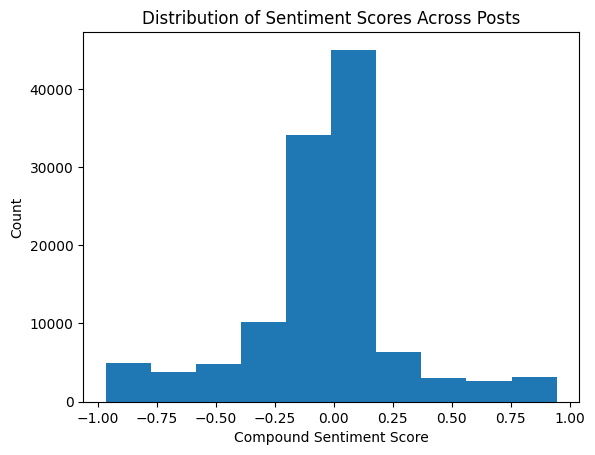

## Project: Reddit Sentiment $\implies$ Stock Alpha

This repo tests whether crowd sentiment from r/WallStreetBets
adds incremental forecasting power over daily stock returns using FinBERT
to classify sentiment and pulling ticker data from Yahoo! Finance.

* **Data**  
  * WallStreetBets posts 2015-2024 (Kaggle).  
  * NASDAQ daily prices (Yahoo! Finance).

* **Scripts**
  * `src/preprocess`: extract the relevant tickers from Reddit post body
  * `src/sentiment`: produce csv file with sentiment score for each post
  * `notebooks/wsb_sentiment_ic.ipynb`: entire analysis

* **Key results**  
  * Mean weekly IC = 0.0216
  * Newey–West t = -0.18 (p-value: 0.858)

There was not evidence of statistical significance between next-day returns and the sentiment of posts.

~[Sentiment Score versus Next Day Returns](img/sentiment_vs_returns.png)

* **Next steps**  
  * Sector-neutralise signals.
  * Incorporate more recent data  
